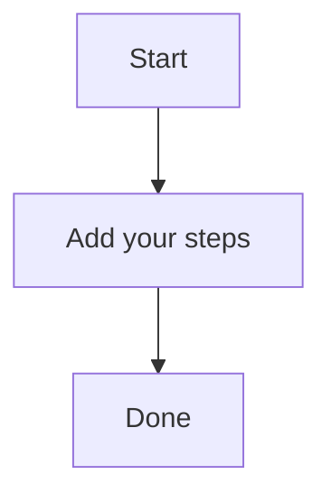

# Secure n8n

A brief summary of the topic.



This is a sample flowform in Markdown format.

It has two paragraphs and one short sentence.

The tone is formal and professional.

Example usage:

```markdown
## This is an example flowform.
### It has multiple lines of text.
```

This flowform uses the standard syntax for defining a form in FlowformLab. The syntax is as follows: 

- Define your form's section using `
- Use Markdown formatting to create paragraphs and sentences
- Keep your content concise and easy to read
- Use natural body prose only
- Output only JSON, without commentary
