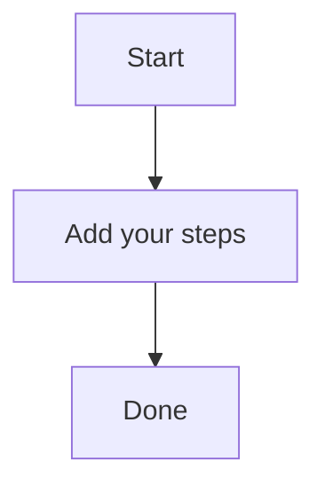

# Key Steps

A brief summary of the topic.

This is a sample flowform for self writing blog using Llama 3.2 1B hosted locally in docker setup. the pros n cons. .

It has two fields:  and .

These fields are required. If you don't fill them out, the form won't work properly.

You can edit these fields in the FlowformLab editor to make sure everything is correct.
