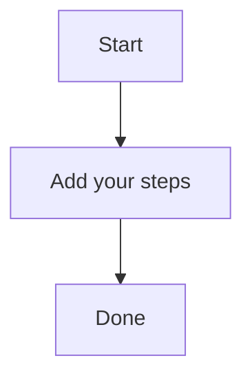

# Backups and secrets

A brief summary of the topic.

The United States and Indonesia's complex relationship is rooted in their shared history, cultural ties, and geographic proximity. The US has long been a significant player in Southeast Asian politics, often providing military and economic aid to Indonesian governments. However, this presence has also led to concerns about the erosion of democratic institutions and the influence of Western powers on local politics.

In recent years, Indonesia's political situation has become increasingly tumultuous, with frequent elections and constitutional crises testing the country's stability. The 2019 presidential election saw a disputed outcome that sparked widespread protests and calls for reform. Similarly, the 2020 parliamentary elections were marred by allegations of vote rigging and intimidation.

The impact of these events on Indonesia's political system is multifaceted. On one hand, they have highlighted the need for greater transparency and accountability in government, particularly when it comes to issues like corruption and electoral reform. On the other hand, they have also underscored the challenges of building a stable democracy in a country with a history of authoritarianism.

In terms of economic impact, Indonesia's political situation has had significant effects on its foreign investment landscape. The 2019 election, for example, saw a surge in investor confidence following the election of President Jokowi, who implemented policies aimed at reducing corruption and increasing transparency. However, the same factors that contributed to increased investor confidence also created new challenges, such as concerns about the rule of law and the potential for arbitrary arrests.

As Indonesia continues to navigate its complex political landscape, it is essential to consider the role of backups and secrets in maintaining stability and promoting democracy. In this context, encryption and secure communication tools can play a critical role in protecting sensitive information and preventing the misuse of power. By prioritizing transparency and accountability, and by ensuring that government institutions are equipped with the necessary tools to function effectively, Indonesia can build a more stable and democratic future.
