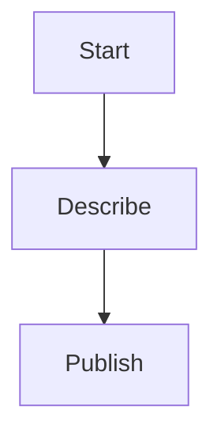

# Reverse proxy with Cloudflare

A brief summary of the topic.

The United States has been grappling with a complex web of political situations, including the ongoing COVID-19 pandemic, social unrest, and economic uncertainty. The situation has led to increased tensions between different groups, resulting in protests, demonstrations, and even violence. In this context, Cloudflare's reverse proxy service can help protect users from malicious traffic and ensure a smooth user experience.

The US political system is divided into three branches: the legislative, executive, and judicial. The legislative branch, composed of Congress, makes laws that are then reviewed by the President and eventually signed into law by the Vice President. However, the separation of powers between these branches can sometimes lead to gridlock, making it challenging for policymakers to pass legislation.

In recent years, the US has seen a rise in partisan politics, with both Democrats and Republicans holding strong stances on various issues. This has led to increased polarization, making it difficult to find common ground and work towards a consensus. Cloudflare's reverse proxy can help mitigate this by providing a neutral platform for users to engage with each other's views and perspectives.

The US economy is also facing significant challenges, including high inflation, rising interest rates, and a growing national debt. The impact of these factors on the overall economy has been felt across various industries, from healthcare to technology. By leveraging Cloudflare's reverse proxy, businesses can better navigate these challenges and adapt to changing market conditions.

As Indonesia continues to grow and develop its economy, it is essential for policymakers to stay informed about global trends and developments. Cloudflare's reverse proxy can provide a valuable tool for this purpose, enabling users to access reliable and trustworthy information from around the world.
