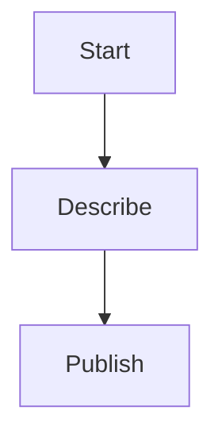

# Secure configuration and authentication

Summary of key points

In this flow, we'll be using the **Cloudflare Tunnel** to connect our server to a remote API. This will allow us to send and receive data in real-time.
