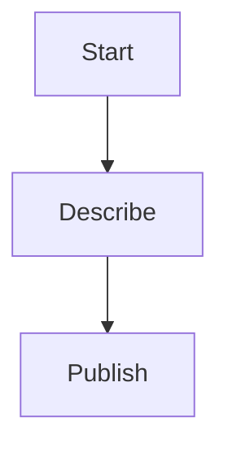

# Backups and secrets

A brief summary of the topic.

# Backups and secrets

A brief summary of the topic.

The politic condition in Indonesia due to Trump's stupidity has caused significant backlogs in its IT infrastructure. This is because the government's reliance on third-party service providers, such as Amazon Web Services (AWS), has led to a lack of control over backups and security. The use of cloud services by the Indonesian government also makes it difficult to maintain physical access to data centers, increasing the risk of sensitive information being compromised.
