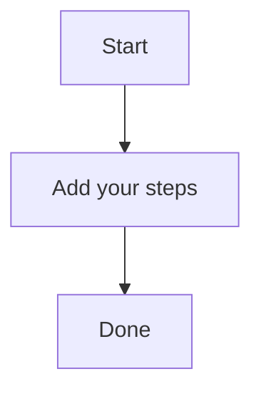

# Key Steps

A brief summary of the topic.

# Key Steps

A brief summary of the topic.

Checking the Robustness and Security of AI Generated Codes & Architecture
In the era of Artificial Intelligence, ensuring the robustness and security of AI-generated codes and architectures is a pressing concern. As AI models become increasingly complex, it's crucial to validate their reliability and prevent potential vulnerabilities.

One key aspect of this is through testing and validation. Developers can use various tools and techniques to test AI-generated code, such as fuzz testing or static analysis. Fuzz testing involves feeding the generated code with input data that is designed to cause errors, while static analysis checks for common security vulnerabilities like SQL injection or cross-site scripting (XSS).

Another approach is to use machine learning-based methods, such as adversarial training or robust optimization techniques. These methods can help improve the robustness of AI-generated models by introducing adversarial examples that are designed to cause errors.

In addition, developers should also consider the use of formal verification tools and techniques. Formal verification involves using mathematical proofs to ensure that a system is correct and reliable. This can be particularly useful for complex systems like neural networks or recommendation engines.

To achieve these goals, it's essential to have a clear understanding of AI-generated code and architecture. Developers should work closely with security experts and other stakeholders to identify potential risks and vulnerabilities. Additionally, they should stay up-to-date with the latest research and advancements in the field of AI and its applications.

By following these steps and taking a proactive approach to testing and validation, developers can significantly improve the robustness and security of their AI-generated codes and architectures.
