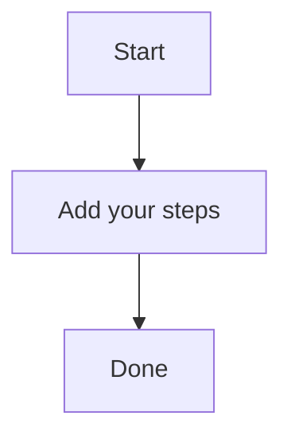

# Secure n8n

A brief summary of the topic.

{"section_md": "The importance of adaptability in business operations\nIn today's fast-paced and ever-changing business landscape, being able to adapt quickly is crucial for survival.\nThis means being agile and responsive to changing market conditions, customer needs, and technological advancements.\nIt also involves having a strong network of relationships with suppliers, partners, and stakeholders who can provide support and guidance when needed."